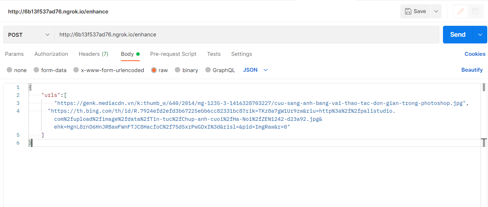
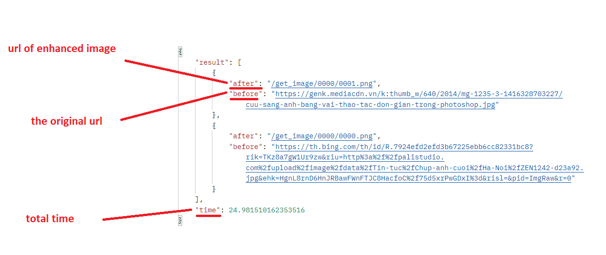

# Instruction
## Install linraries
```
pip install requirements.txt
```
## Testing API
- First, running the ./app.py file.
```
python app.py
```
- Then runing the ./request.py to send request to the API.
```
python request.py
```
## About the api
- The API receive raw JSON data.
- You have to post raw JSON data, which contains the element 'urls' having an array of images need to be enhanced. Here is an example.
```
{
    "urls":[
        "https://genk.mediacdn.vn/k:thumb_w/640/2014/mg-1235-3-1416328703227/cuu-sang-anh-bang-vai-thao-tac-don-gian-trong-photoshop.jpg",
      "https://th.bing.com/th/id/R.7924efd2efd3b67225ebb6cc82331bc8?rik=TKz8a7gW1Ur9zw&riu=http%3a%2f%2fpalistudio.com%2fupload%2fimage%2fdata%2fTin-tuc%2fChup-anh-cuoi%2fHa-Noi%2fZEN1242-d23a92.jpg&ehk=HgnL8rnD6HnJRBawFWnFTJC8HacfoC%2f75d5xrPwGDxI%3d&risl=&pid=ImgRaw&r=0"
    ]
}
```
- In Postman, we will post data like this.

## About the result
```
{
    "result": [
        {
            "after": "/get_image/0002/0001.png",
            "before": "https://genk.mediacdn.vn/k:thumb_w/640/2014/mg-1235-3-1416328703227/cuu-sang-anh-bang-vai-thao-tac-don-gian-trong-photoshop.jpg"
        },
        {
            "after": "/get_image/0002/0000.png",
            "before": "https://th.bing.com/th/id/R.7924efd2efd3b67225ebb6cc82331bc8?rik=TKz8a7gW1Ur9zw&riu=http%3a%2f%2fpalistudio.com%2fupload%2fimage%2fdata%2fTin-tuc%2fChup-anh-cuoi%2fHa-Noi%2fZEN1242-d23a92.jpg&ehk=HgnL8rnD6HnJRBawFWnFTJC8HacfoC%2f75d5xrPwGDxI%3d&risl=&pid=ImgRaw&r=0"
        }
    ],
    "time": 25.083990812301636
}
```


